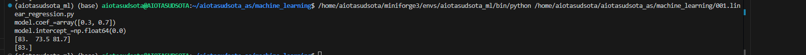
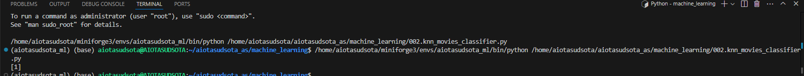
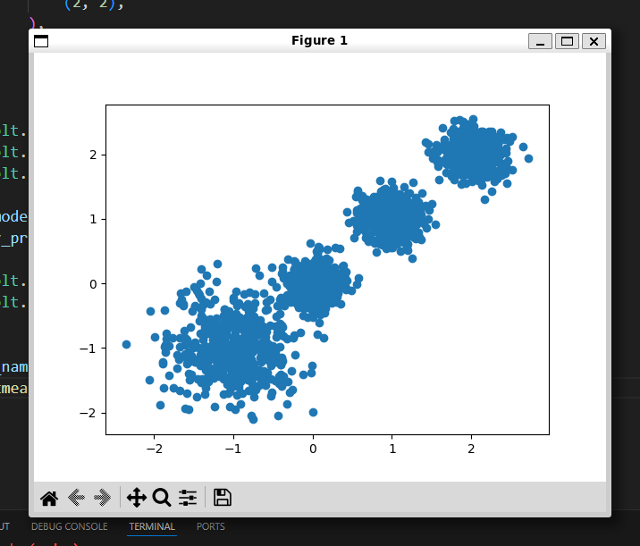
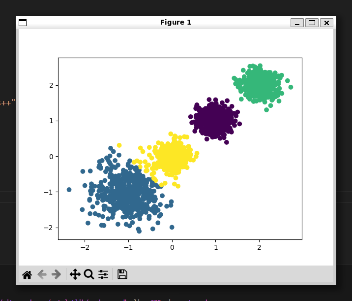

# Machine Learning 学习笔记

## 0. 环境安装

### python环境：python=3.13

```shell
pip install scikit-learn matplotlib
```

## 1. 机器学习的三种任务

- 回归问题
- 分类问题
- 聚类问题

## 2. 机器学习三种任务初探

#### 2.1 回归问题

```python
from sklearn.linear_model import LinearRegression
import joblib


def linear_regression_train_predict():
    x = [[80, 86], [82, 80], [85, 78], [90, 90], [86, 82], [82, 90], [78, 80], [92, 94]]
    y = [84.2, 80.6, 80.1, 90, 83.2, 87.6, 79.4, 93.4]

    model = LinearRegression()

    model.fit(x, y)

    print(f"{model.coef_=}")
    print(f"{model.intercept_=}")

    # y_pred = model.predict([[90, 80]])
    y_pred = model.predict([[90, 80], [70, 75], [81, 82]])
    print(y_pred)

    # 保存模型
    joblib.dump(model, "models/linear_regression_checkpoint.bin")

    model = joblib.load("models/linear_regression_checkpoint.bin")

    y_pred = model.predict([[90, 80]])
    print(y_pred)


if __name__ == "__main__":
    linear_regression_train_predict()
```



#### 2.2 一般分类任务

```python
from sklearn.neighbors import KNeighborsClassifier


def knn_movies_classifier():
    # 电影分类
    x = [
        [39, 0, 31],
        [3, 2, 65],
        [2, 3, 55],
        [9, 38, 2],
        [8, 34, 17],
        [5, 2, 57],
        [21, 17, 5],
        [45, 2, 9],
    ]
    y = [0, 1, 2, 2, 2, 1, 0, 0]  # 0: 喜剧片 1: 动作片 2: 爱情片

    model = KNeighborsClassifier()

    model.fit(x, y)

    y_pred = model.predict([[3, 3, 37]])

    print(y_pred)


if __name__ == "__main__":
    knn_movies_classifier()
```



#### 2.3 聚类任务

```python
from sklearn.cluster import KMeans
import matplotlib.pyplot as plt
from sklearn.datasets import make_blobs


def kmeans():
    x, y = make_blobs(
        n_samples=2000,
        n_features=2,
        centers=(
            (-1, -1),
            (
                0,
                0,
            ),
            (1, 1),
            (2, 2),
        ),
        cluster_std=(0.4, 0.2, 0.2, 0.2),
        random_state=22,
    )

    plt.figure()
    plt.scatter(x[:, 0], x[:, 1], marker="o")
    plt.show()

    model = KMeans(n_clusters=4, init="k-means++", random_state=22)
    y_pred = model.fit_predict(x)

    plt.scatter(x[:, 0], x[:, 1], c=y_pred)
    plt.show()


if __name__ == "__main__":
    kmeans()
```





## 3. 机器学习相关概念

### 3.1 欠拟合和过拟合

欠拟合：模型在训练集上表现很差，在测试集上也表现很差。

过拟合：模型在训练集上表现很好，但是在测试集上表现不好。

### 3.2 欠拟合和过拟合产生的原因

- 欠拟合产生的原因：模型过于简单
- 过拟合产生的原因：模型过于复杂、数据不纯、训练数据较少等造成的

### 3.3 AI发展三要素

- 数据、算法、算力三要素相互作用，是未来AI发展的基石

### 3.4 归一化和标准化

#### 3.4.1 为什么做归一化和标准化？

答：特征的单位或者大小相差较大，或者某特征的方差相比其他的特征要大出几个数量级，容易影响（支配）目标结果，使得一些模型（算法）无法学习到其他的特征。


## 4.K-近邻算法

#### 4.1 欧氏距离

计算两个样本特征的相似度，通过$d_{12} = \sqrt{(x_1 - x_2)^2 + (y_1 - y_2)^2 + ... + (Z_1 - Z_2)^2}$来计算两个样本特征维度的相似度， 

其中 $x_1$ 、$y_1$ 、$...$ 、 $Z_1$是样本1的所有特征， $x_2$ 、$y_2$ 、$...$ 、 $Z_2$是样本2的所有特征

| 序号 |  电影名称  | 搞笑镜头 | 拥抱镜头 | 打斗镜头 | 电影类型 |
| :--: | :--------: | :------: | :------: | :------: | :------: |
|  1   |  功夫熊猫  |    39    |    0     |    31    |  喜剧片  |
|  2   |   叶问3    |    3     |    2     |    65    |  动作片  |
|  3   |  伦敦陷落  |    2     |    3     |    55    |  动作片  |
|  4   |  代理情人  |    9     |    38    |    2     |  爱情片  |
|  5   | 新步步惊心 |    8     |    34    |    17    |  爱情片  |
|  6   |  谍影重重  |    5     |    2     |    57    |  动作片  |
|  7   |  功夫熊猫  |    39    |    0     |    31    |  喜剧片  |
|  8   |   美人鱼   |    21    |    17    |    5     |  喜剧片  |
|  9   |  宝贝当家  |    45    |    2     |    9     |  喜剧片  |
|  10  | 唐人街探案 |    23    |    3     |    17    |    ？    |

#### 4.2 K-近邻算法

- 解决的问题：分类问题、回归问题
- 算法思想：若一个样本在特征空间中的k个最相似的样本大多数属于某一个类别，则该样本也属于这个类别
- 相似性：欧氏距离

##### 分类流程

1.计算未知样本到每一个训练样本的距离

2.将训练样本根据距离大小升序排列

3.取出距离最近的K个训练样本

4.进行多数表决，统计K个样本中哪个类别的样本个数最多

5.将未知的样本归属到出现次数最多的类别

##### 回归流程

1.计算未知样本到每一个训练样本的距离

2.将训练样本根据距离大小升序排列

3.取出距离最近的K个训练样本

4.把这个K个样本的目标值计算平均值

5.作为将未知的样本预测的值

## 5. KNN算法

#### 1. 距离测量和K值的选择

##### 常用的距离计算公式、k值选择：

- 欧式距离
- 曼哈顿距离
- 切比雪夫距离


